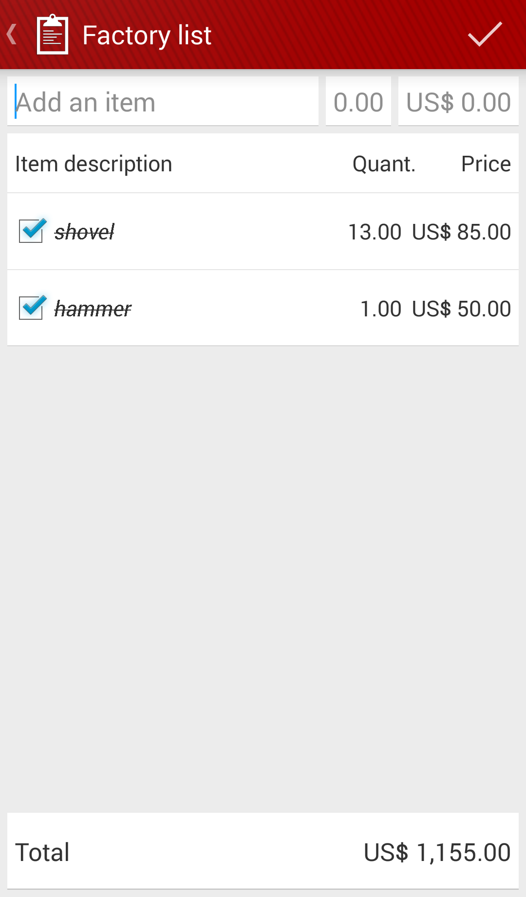
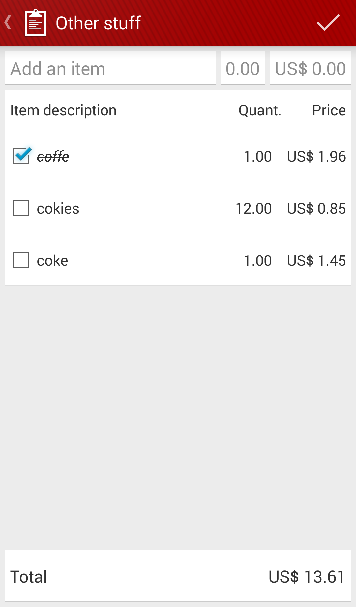
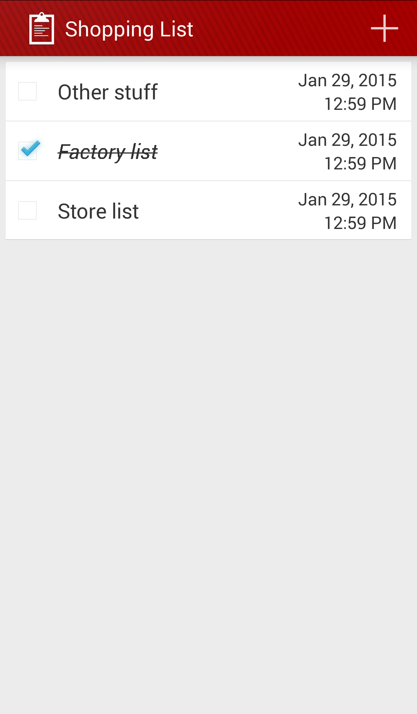
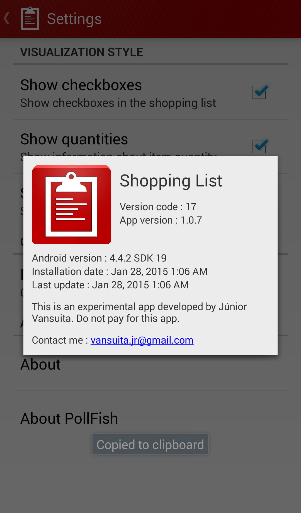

<!-- Project Logo -->

<!-- Buy me a cup of coffe -->

# ShoppingList

This project is my very first Android app. I created it back in 05/21/2014 while took Android classes at [Proway IT Training](http://proway.com.br/).
This's a shopping list app. The user can create shopping lists or to-do lists. After adding some items, you can mark them as done. As a shopping list app, you can also apply prices and quantities for your items. The interfaces and workflow will never be updated, by purposely. I want to keep it as a remembrance.

  

<!-- License -->
<!-- Minimun Android Api -->
<!-- Apptize.io -->
 <!-- Hits Count -->
 <!--Open Source --> 

# Screenshots
      

# Techonologies
 * Android SDK.
 * SQLite.
 * ~~[PollFish](https://www.pollfish.com) library.~~
 * ~~[Google Play Services](https://developers.google.com/android/guides/overview).~~
  
# Features
 * Create a shopping list.
 * Create items for the shopping lists.
 * Mark itens as done.
 * Set prices and quantities.
 * Share the shopping lists as text.
 * Share the shopping lists as file.
 * Exporting/Importing shopping lists as files.
 * Scheduling future shops.
 * Barcode scanner.
 * ~~[PollFish](https://www.pollfish.com) ads integration.~~
 * ~~[Google AdMob](https://www.google.com/admob/) integration.~~
 
  
# 

